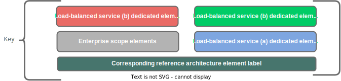

# A Generalized Reference Architecture for DNS-Based Global Load Balancing (dGLB)

Global load balancing is a service that directs inbound connections to a nominal application/service to instances of the actual application/service, typically at geographically dispersed locations. GLB is distinguished from ALB in that it deals effectively with distributing traffic across multiple physical locations, rather than just across application-instances within a single location. This document attempts to establish a generalized reference architecture for GLB enabled by DNS (dGLB.)

# Contents

...later...

# Overview

## Functional Description

In this architecture, a DNS-based global-load-balancing (dGLB) service provides a mechanism for distributing incoming connections across a given application/service to two or more different locations where clusters of the application/service are being front-ended by application load balancers (ALBs.)  The GLB devices implement several core functions:

* Responding to DNS queries for the FQDNs of globally load-balanced services
* Performing health-checks of the downstream load-balancing targets for each GLB-hosted FQDN
* Executing a configured policy to determine **which**  downstream load-balancing target's information to include in DNS responses for the load-balanced FQDNs

By executing these functions, the GLB devices are able to distribute "connections" to a given FQDN across backend targets.  dGLB is ***only*** in-path for the DNS phase of client-to-server connectivity, which makes for extremely low capacity requirements on the GLB devices, but significantly limits to granularity and accuracy with which load-balancing can be implemented.

## Conceptual Architecture Diagram

# Essential Functions of the dGLB Appliances

There are several critical functions to be performed by the dLGB appliances, although not all are required for each use case

* Responding authoritatively to DNS queries for the FQDN of a load-balanced service to direct traffic *from* a subset of client-devices
* Performing health-checks on the load-balancing targets that have been configured for each load-balanced service’s FQDN
* 

## Respond Authoritatively to DNS Queries for FQDNs of Load-balanced Services

# Elements of the Architecture

## Conventions

The italicized suffix "<em>(a-n)</em>" is used to indicate that multiple instances of this element may be instantiated, with a parenthesized alphabetic character index to differentiate between instances.  For example, an element definition with a label of "cl(<em>a-n</em>)"  could may be instantiated multiple times.  In such a case, individual instances would be named:  "cl(a)", "cl(b)", cl(c)", etc..

## Element Definitions

| Element Label | Element Name | Element Description |
| ------------- | ------------ | ------------------- |
| "<em>app(a-n).</em>ai<em>(a-n)</em>" | Application instances | Instances of the nominal backend application/service that is being load-balanced by the GLB and ALB services.  There must be a minimum of one instance at a minimum two locales, but there may be more instances (a-n) |
| "alb<em>(a-n)</em>" | Application load-balancers | Instances of application load-balancers.  There *must* be a minimum of two instances in separate locales, but there *may* be more instances (c-n). |
| "ans1<em>(a-n)</em>" | Enterprise authoritative nameservers | The authoritative nameservers for the enterprise-domain (e.g. "Example Domain ").  There 1 or many instances (a-n) of this element.   It is *assumed* that access to the authoritative nameservers by recursive resolvers is mediated by either IP anycast at the network layer, or the use of multiple NS records in whichever external nameservers have delegated "ed1" to the enterprise. |
| "app<em>(a-n)</em>" | Load-balanced application | The application that the global load-balancer is serving.  There may be zero, one, or many load-balanced applications.  (Though there is not much use for a global load-balancer if there are no applications to load-balance.) |
| "cl<em>(a-n)</em>" | Clients | Client devices accessing the globally load-balanced services. There may be 0, 1, or many instances (a-n) of this element present in locales with or without instances of the load-balanced applications. |
| "ed1<em>(a-n)</em>" | Enterprise domain | A DNS domain for which the enterprise authoritative nameservers are authoritative.  "Example Domain " is used as an example throughout this architecture specification. |
| "fqdn1<em>(a-n)</em>" | Client-facing GLB service FQDN | The fully-qualified domain name (FQDN) of a globally load-balanced service which is used by clients of the service.  Each globally-load-balanced service has its own dedicated FQDN, in the "ed1" domain ("rrset3"). E.g "svc-x.example.com" |
| "fqdn2<em>(a-n)</em>" | GLB-hosted service FQDN | The fully-qualified domain name (FQDN) of a globally load-balanced service which is exposed hosted authoritatively by the GLB. (E.g. "svc-x.glb.example.com) in glbd1.  Each globally-load-balanced service has its own dedicated FQDN, in the "glbd1" domain. |
| "fqdn3<em>(a-n)</em>" | FQDN that appears in glbpool1 | A fully-qualified domain name (FQDN) that appears in the list of load-balancing targets for a GLB-hosted service FQDN. |
| "fqdn4<em>(a-n)</em>" | FQDNs of the authoritative nameserver function for each "glb" instance | The fully qualified domain (FQDN) used in the "delegation" (NS) record on the enterprise authoritative namserver's "ed1" zonefile. |
| "glb<em>(a-n)</em>" | Global load-balancers | Instances of DNS-based global load-balancers.  There must be a minimum of two instances ("glb(a)", and glb(b)" in a minimum of two "locales", but there may be more instances (c-n).  All instances of "glb" must share a synchronized configuration and run-state and must be deployed in a fully resilient manner. |
| "glbd1<em>(a-n)</em>" | Global load-balancing domain | A DNS sub-domain of the enterprise domain (ed1) which has been delegated by the enterprise authoritative nameservers (ans1) to the global load-balancers (glb1).  "glb.example.com" is used as an example throughout this architecture specification.  There must be a minimum of instance of this element, but additional instances (b-n) are permitted. |
| "glbp(a-<em>n</em>)" | GLB policy | A nominal policy executed on the GLB instances ("glb(a-n)") which determines *which* element of "glbpool(a-n)" the GLB will include in its response to a query of "fqdn2(a-n)".  This policy will *typically* use some combination of the following data elements:<ul><li>The state of "alb(n)" instances appearing in the "glbpool(n)" of "fqdn2(n)"<ul><li>As inferred from the health-checks in network flow #10</li></ul></li><li>Geographic proximity of "rr(n)" and "alb(n)" instances<ul><li>As inferred from a nominal IP-based geo-location service</li></ul></li><li>The contents of the nominal session-persistence table for "fqdn(2)" in "glb(a-n)"</li><li>Explicitly configured preference for a given entry on "glbpool(n)"</li></ul>An instance of "glbp" *must* be applied to every instance of "fqdn2".  The same policy *may* be applied to multiple instances of "fqdn2" |
| "glbpool<em>(a-n)</em>" | List of load-balancing targets for a GLB-hosted service FQDN | The list of load-balancing targets for a GLB-hosted service FQDN ("fqdn2", e.g. "svc-x.glb.example.com).  The items in this list may be either IP addresses or FQDNs.  There must be a single instance of this element for each globally-load-balanced service. |
| "locale<em>(a-n)</em>" | Workload hosting locale | An environment in which IT workload can be hosted.  *May* denote regionally-based availability zones.  *Must* be sufficiently localized for an ALB within the locale to effectively serve backend load-balancing targets in the same locale. |
| "rr<em>(a-n)</em>" | DNS recursive resolvers | Recursive DNS resolvers serving the clients.  There 1 or many instances (a-n) of this element.  It is *assumed* that access to the DNS resolvers by the client devices is mediated by either IP anycast on the transport network or round-robin rotation on the part of the client devices (each configured with the IP addresses of *multiple* "rr" instances.) |
| "rrset1<em>(a-n)</em>" | glbd delegation ns resource record set | A set of NS records maintained (<em>below</em> the zone apex) in the enterprise domain (ed1) zonefile on the enterprise authoritative nameservers ("ans1") with values of the individual GLB instances ("glbd1").   The "name" value of these records is the global load-balancing domain (glbd1) and the RDATA value an FQDN of a "glb" instance.  There is a separate record for each GLB instance. |
| "rrset2<em>(a-n)</em>" | glbd delegation glue resource record set | A set of A records maintained in the enterprise domain (ed1) zonefile on the enterprise authoritative nameservers (ans1) with "name" values of the individual GLB instances ("glbd1").  The "name" field in each of these resource-records must correspond directly to the RDATA field from one of the rrset1 records. |
| "rrset3(a-n)" | GLB service CNAME record | A CNAME record maintained in the enterprise domain ("ed1") zone on the enterprise authoritative nameservers ("ans1") for each globally load-balanced service's FQDN ("fqdn1").  The "name" portion of each resource-record is the unique relative (aka host-only) value assigned to a single globally load-balanced service.   The RDATA field is the corresponding FQDN (fqdn2) configured on the global load-balancers (glb1) for the same globally load-balanced service. |
| "rrset4(a-<em>n</em>)" | GLB service FQDN synthetic A records | A "synthetic" A record resource record set maintained on the global load-balancers (glb1).  Each globally load-balanced service must have a corresponding configuration on glb1 that is "keyed" to a fully qualified domain name (FQDN) in the global load-balancing domain ("glbd1".)  If the entries in the nominal load-balancing target pool for the GLB service's FQDN are IP addresses, the glb will respond to queries with dynamically generated A records. |
| "rrset5(a-<em>n</em>)" | GLB service FQDN synthetic CNAME records | A "synthetic" CNAME record resource record set maintained on the global load-balancers (glb1).  Each globally load-balanced service must have a corresponding configuration on glb that is "keyed" to a fully qualified domain name (FQDN) in the global load-balancing domain (glbd.)  If the entries in the nominal load-balancing target pool for the GLB service's FQDN are FQDNs, the glb will respond to resolution requests for the GLB service's FQDN with dynamically generated CNAME records, aliasing the GLB's service's FQDN to the FQDN of an item from the configured list of load-balancing targets. |
| "rrset6(a-<em>n</em>)" | ALB FQDN A records | An A record resource set maintained on the authoritative nameservers for any FQDNs that are included in the glbpool.  (E.g. "alb1.example.com") |

# Functional Architecture Diagram

# Network Flow Table

The following table enumerates the flows labeled in the previous diagram along with their descriptions.

| Flow# | Description |
| ----- | ----------- |
| 1 | DNS query to resolve the advertised FQDN (eg. "[svc-x.example.com](http://svc-x.example.com/ "http://svc-x.example.com")) of a globally load-balanced service.  From client (c1/c2) to its preferred DNS resolver (rr1/rr2) |
| 2 | DNS query to resolve the same FQDN as in flow 1/1a (eg. "[svc-x.example.com](http://svc-x.example.com/ "http://svc-x.example.com")) of a globally load-balanced service.  From a recursive resolver (rr1/rr2) to the enterprise authoritative name-server (ans1) |
| 3 | DNS *response* to query from  flow 2. From ans to rr.  Response includes:  rrset3, rrset2, and rrset1. |
| 4 | DNS query from rr to glb.  Querying the RDATA portion of the CNAME record  (e.g. [svc-x.example.com](http://svc-x.example.com/ "http://svc-x.example.com")) from flow 3 (data from rrset3) and specifying "A" record type |
| 5 | DNS response from glb1 to rr.  Response includes either an A record or CNAME record |
| 6 | DNS query from rr to authoritative nameserver to resolve CNAME record returned in flow 5 |
| 7 | DNS response to query from flow 6.  Response includes one or more A records |
| 8 | DNS response from rr to client (response to query from flow 1) |
| 9 | Health-checks from GLB instances to members of their  target pools |
| 10 | Health-checks from ALBs to members of their target pools |
| 11 | Application traffic ***from*** clients to ALBs |
| 12 | Application traffic ***from*** ALBs to service instances |

***

# DNS Zone Structure/Content Diagram

The structure of the DNS zones maintained by the DNS authoritative nameservers global load-balancers is illustrated in the following figures.

***

# DNS Resolution Process Flowchart

The process of DNS resolution from client-device, to recursive-resolver, to authoritative nameserver, back to recursive-resolver, to glb, back to recursive resolver, and back to client-device is depicted in the following flowcharts:

