## Functional Description

In this architecture, a DNS-based global-load-balancing (dGLB) service provides a mechanism for distributing incoming connections across a given application/service to two or more different locations where clusters of the application/service are being front-ended by application load balancers (ALBs.)  The GLB devices implement several core functions:

* Responding to DNS queries for the FQDNs of globally load-balanced services
* Performing health-checks of the downstream load-balancing targets for each GLB-hosted FQDN
* Executing a configured policy to determine **which**  downstream load-balancing target's information to include in DNS responses for the load-balanced FQDNs

By executing these functions, the GLB devices are able to distribute "connections" to a given FQDN across backend targets.  dGLB is ***only*** in-path for the DNS phase of client-to-server connectivity, which makes for extremely low capacity requirements on the GLB devices, but significantly limits to granularity and accuracy with which load-balancing can be implemented.

## Conceptual Architecture Diagram

The structure of the DNS zones maintained by the DNS authoritative nameservers is illustrated in the following figure.

Show/hide key

Show/hide diagram

