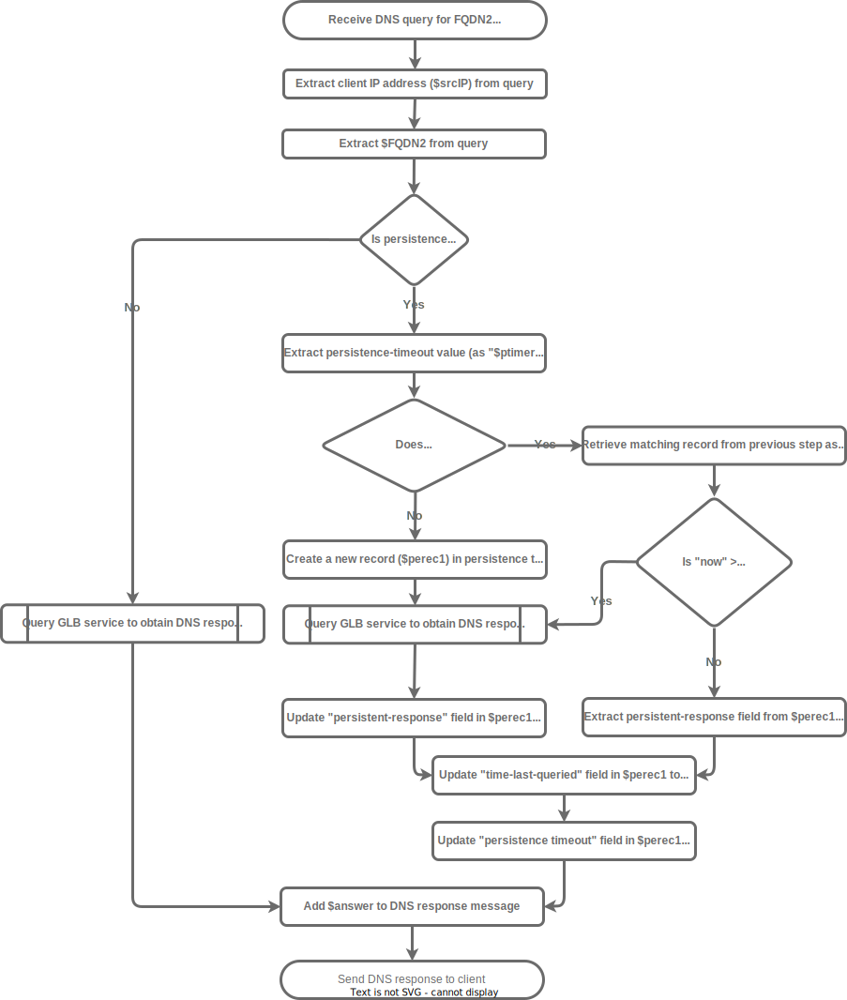

DNS-based global load-balancing can implement a "persistence" mechanism to help ensure that a given client is consistently sent to the same ALB instance. This persistence mechanism is implemented on the GLB devices, and causes the GLB to continue to provide the same response to a DNS-client (typically the actual client's preferred recursive resolvers) when it queries a given load-balanced FQDN as long as the persistence mechanism is engaged. (The persistence timer mechanism must supersede any traditionally configured DNS TTL for the FQDN.) That persistence table would need to include at least the following fields:

* Client-IP address
* Queried FQDN
* Time of last query
* Persistence timeout
* Persistent response

The first two fields act as a primary key for the table. That is, there can be no more than one record with the same values in the "Client-IP address" and "Queried FQDN" fields.

The following flow-chart illustrates the persistence-related logic that a GLB executes when it receives a query for an FQDN that it is servicing:




Show/hide flowchart

