## Functional Description

In this architecture, a DNS-based global-load-balancing (dGLB) service provides a mechanism for distributing incoming connections across a given application/service to two or more different locations where clusters of the application/service are being front-ended by application load balancers (ALBs.)  The GLB devices implement several core functions:

* Responding to DNS queries for the FQDNs of globally load-balanced services
* Performing health-checks of the downstream load-balancing targets for each GLB-hosted FQDN
* Executing a configured policy to determine **which**  downstream load-balancing target's information to include in DNS responses for the load-balanced FQDNs

By executing these functions, the GLB devices are able to distribute "connections" to a given FQDN across backend targets.  dGLB is ***only*** in-path for the DNS phase of client-to-server connectivity, which makes for extremely low capacity requirements on the GLB devices, but significantly limits to granularity and accuracy with which load-balancing can be implemented.

## Conceptual Architecture Diagram

***

## Common Use Cases

Because dGLB provides a relatively coarse-grained mechanism for traffic distribution, it is of relatively low utility for balancing (the irony isn't lost on anyone) workload distribution across targets. Use cases are instead best differentiated by the resiliency models they enable.

### Active/Standby

In the active/standby use-case, the FQDN for a globally-load-balanced service will have exactly two targets. One of the targets (steady-state) is tasked for use during steady-state operating mode, and the other target (recovery) is tasked for use *only* if the steady-state instance fails. The dGLBs are configured with policy to ensure that they reply to DNS queries use the "steady-state" target's data as long as the steady-state target is passing healtchecks with the dGLB, and to respond using the "recovery" instance's data only when it passes healthchecks AND the "steady-state" instance fails healthchecks. This use-case is generally a good match for disaster-recovery scenarios.

### All Active

In the active/active use-case, the FQDN for a globally-load-balanced service will have two or more targets. The dGLB will be configured to alternate using the data of *each* target that is passing healtchekcs when responding to queries for the FQDNs of load-balanced services. The manner of alternation may vary greatly depending on the functionality of the specific dGLB platform and the nuances of the deployed workload.

