## Network Flow Table

The following table lists the network flows associated with the execution of the global load-balancing function, beginning with a client-device attempting to perform DNS resolution for the FQDN of a globally-load-balanced service.


| Flow# | Description |
| ----- | ----------- |
| 1 | DNS query to resolve the advertised FQDN (eg. svc-x.example.com) of a globally load-balanced service.  From client (c1/c2) to its preferred DNS resolver (rr1/rr2) |
| 2 | DNS query to resolve the same FQDN as in flow 1/1a (eg. svc-x.example.com) of a globally load-balanced service.  From a recursive resolver (rr1/rr2) to the enterprise authoritative name-server (ans1) |
| 3 | DNS *response* to query from  flow 2. From ans to rr.  Response includes:  rrset3, rrset2, and rrset1. |
| 4 | DNS query from rr to glb.  Querying the RDATA portion of the CNAME record  (e.g. svc-x.example.com) from flow 3 (data from rrset3) and specifying "A" record type |
| 5 | DNS response from glb1 to rr.  Response includes either an A record or CNAME record |
| 6 | DNS query from rr to authoritative nameserver to resolve CNAME record returned in flow 5 |
| 7 | DNS response to query from flow 6.  Response includes one or more A records |
| 8 | DNS response from rr to client (response to query from flow 1) |
| 9 | Health-checks from GLB instances to members of their  target pools |
| 10 | Health-checks from ALBs to members of their target pools |
| 11 | Application traffic ***from*** clients to ALBs |
| 12 | Application traffic ***from*** ALBs to service instances |

Show/hide table

## Functional Diagram

The following diagram illustrates the low-level topology and network-flows in an implementation of this reference architecture.




Show/hide key




Show/hide diagram

