## Diagram Key

## Enterprise Nameserver DNS Zones

The structure of the DNS zones maintained by the DNS authoritative nameservers is illustrated in the following figure.

## Global DNS Nameserver DNS Zones

The structure of the DNS zones maintained by the global load-balancers is illusrated in the following diagram.

