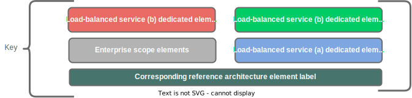

## DNS Zone Structure/Content Diagram

The structure of the DNS zones maintained by the DNS authoritative nameservers global load-balancers is illustrated in the following figures.

## DNS Resolution Process Flowchart

The process of DNS resolution from client-device, to recursive-resolver, to authoritative nameserver, back to recursive-resolver, to glb, back to recursive resolver, and back to client-device is depicted in the following flowcharts:

## DNS Time To Live Guidelines

* All other factors being equal, a lower TTL is preferred
    * This minimizes time to re-direct traffic away from a failed site
    * Should always be at least long enough that DNS operations don't become a hindrance to application/service access
* For active/standby site configurations
    * No special considerations
* For multi-active-site GLB configurations
    * Persistence should be enabled
        * Timer **has** to be higher than the TTL of the DNS record itself.
            * Otherwise, persistence could expire before it actually gets invoked.
* If the GLB's target-pool is populated with FQDNs (and not IP addresses), the TTL value used in the GLB DNS responses to clients *must* not exceed that of the A records for the target FQDNs.
    * If, for example, a 3rd-party dGLB is configured with an FQDN that load-balances to multiple AWS application-load-balancers
        * AWS DNS always responds to resolution requests for ALB's FQDNs with a TTL of 60 seconds.
        * If the dGLB is configured with a 30-second persistence timer, the clients (recursive resolvers) would keep the A records cached past the 30 seconds, and the GLB would expire the persistence-able entry before it received another query

***

