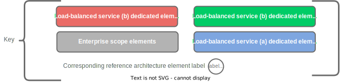

## Diagram Key




Show/hide key

## Enterprise Nameserver DNS Zones

The structure of the DNS zones maintained by the DNS authoritative nameservers is illustrated in the following figure.



Show/hide diagram

## Global DNS Nameserver DNS Zones

The structure of the DNS zones maintained by the global load-balancers is illusrated in the following diagram.



Show/hide diagram

